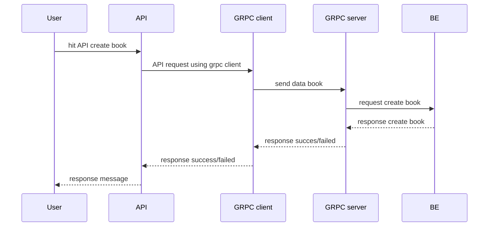

## Golang Restfull API

Hello, this is Golang Restfull API using echo go framework, this repository using postgres as databases. and use [golang-migrate](https://github.com/golang-migrate/migrate/tree/master/database/postgres) for database migration mechanisme

### Some of the ones implemented in this repository:
1. Restfull API
2. Google Sheet Integration
3. GRPC
4. Unit Test

### GRPC Workflow
1. case creating book

### how to run app (makefile run on windows command)
1. `install make to run Makefile command` 
2. `create database`
3. install **golang-migrate** using go install -tags 'database1,database2' github.com/golang-migrate/migrate/v4/cmd/migrate@latest for example `go install -tags 'postgres,mysql' github.com/golang-migrate/migrate/v4/cmd/migrate@latest` 
4. `run the migration` use `make migrationup`
5. you can run with **How to Run APP** 

### How to RUN APP
1. make tidy
2. make run

### Database Migration Mechanisme
1. use `make migration NAME=your_command` to create migration file
2. fill the migration file based on you requirements
3. use `make migrationup` to up your migration
4. use `make migrationdown` to rollback all your migration
5. use `make migrationversion` to check your migration version
6. use `make migrationchange` to force change your migration version

### How to create Mock
1. install `mockery`
2. just run this command `mockery --all --recursive=true --keeptree` or `make mock`
